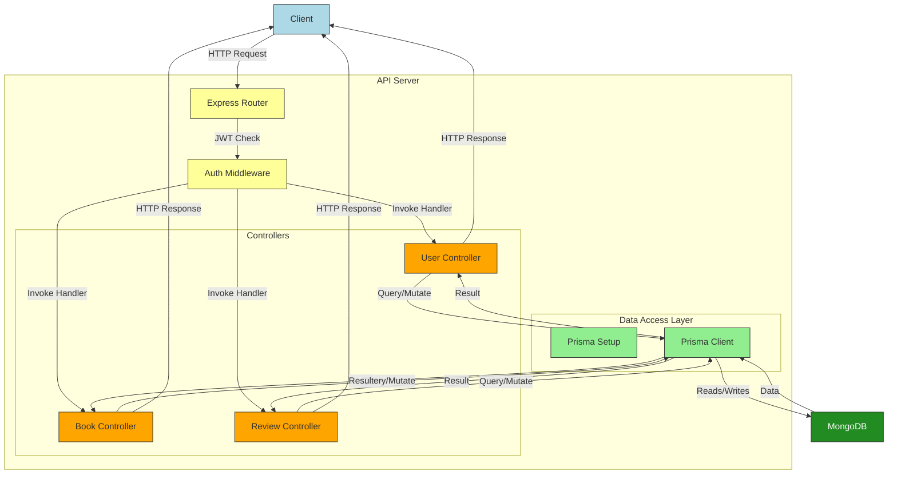

# Book Review API

A RESTful API for managing books and their reviews, allowing users to browse books, submit ratings, and manage their reviews.

## Tech Stack

- **Backend**: Node.js with Express
- **Database**: MongoDB
- **ORM**: Prisma
- **Authentication**: JWT-based authentication

## Setup Instructions

### Prerequisites

- Node.js (v14 or higher)
- MongoDB instance (local or cloud)
- Git

### Installation

1. Clone the repository:

```bash
git clone https://github.com/yourusername/book-review-billeasy.git
cd book-review-billeasy
```

2. Install dependencies:

```bash
npm install
```

3. Create a `.env` file in the root directory and add your MongoDB connection string:

```env
DATABASE_URL="mongodb://localhost:27017/book-review"
JWT_SECRET="your_jwt_secret"
PORT=3000
```

4. Run the Prisma migrations to set up the database:

```bash
npx prisma generate
```

5. Running Locally:

```bash
npm run dev
```

The API will be available at http://localhost:3000 (or whatever PORT you specified)

## API Endpoints

### Authentication

Reguster a new user

```bash
curl -X POST http://localhost:3000/api/users/register \
  -H "Content-Type: application/json" \
  -d '{
    "name": "John Doe",
    "email": "john@example.com",
    "password": "secure_password"
  }'
```

Login a user

```bash
curl -X POST http://localhost:3000/api/users/login \
  -H "Content-Type: application/json" \
  -d '{
    "email": "john@example.com",
    "password": "secure_password"
  }'
```

Response will include a JWT token to use for authenticated endpoints.

### Books

Get all books

```bash
curl -X POST http://localhost:3000/api/books \
  -H "Content-Type: application/json" \
  -H "Authorization: Bearer YOUR_TOKEN" \
  -d '{
    "title": "To Kill a Mockingbird",
    "author": "Harper Lee",
    "genre": "Fiction",
    "description": "A powerful story of coming-of-age in the South.",
    "published": "1960-07-11"
  }'
```

Get all books (with pagination and filters)

```bash
curl "http://localhost:3000/api/books?page=1&limit=10&author=Tolkien&genre=Fantasy"
```

Get a single book by ID

```bash
curl http://localhost:3000/api/books/bookId
```

### Reviews

Submit a review for a book (authenticated)

- A user can only submit one review per book.

```bash

curl -X POST http://localhost:3000/api/books/bookId/review \
  -H "Content-Type: application/json" \
  -H "Authorization: Bearer YOUR_TOKEN" \
  -d '{
    "rating": 5,
    "comment": "One of the best books I have ever read!"
  }'

```

Update a review (authenticated)

```bash
curl -X PUT http://localhost:3000/api/reviews/reviewId \
  -H "Content-Type: application/json" \
  -H "Authorization: Bearer YOUR_TOKEN" \
  -d '{
    "rating": 4,
    "comment": "Updated thoughts - still a great book!"
  }'
```

Delete a review (authenticated)

```bash
curl -X DELETE http://localhost:3000/api/reviews/reviewId \
  -H "Authorization: Bearer YOUR_TOKEN"
```

### Design Decisions & Assumptions

Authencation:

- JWT-based authentication is used for securing endpoints.
- Passwords are hashed using bcrypt for security.

Data Models:

- Users can register with email, password, and name
- Books contain basic information (title, author, genre, description, publication date)
- Reviews have a rating, comment, and are connected to both a book and a user

Business Rules:

- A user can submit only one review per book
- Users can only update or delete their own reviews
- Books can be filtered by author and genre
- Paginated results are available for better performance

API Structure:

- RESTful design with appropriate HTTP methods
- Authentication middleware for protected routes

### Block Diagram


